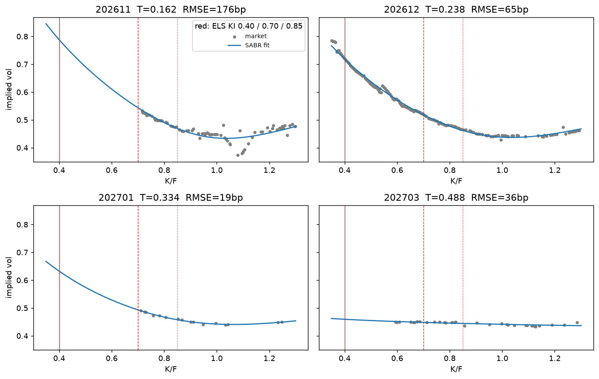
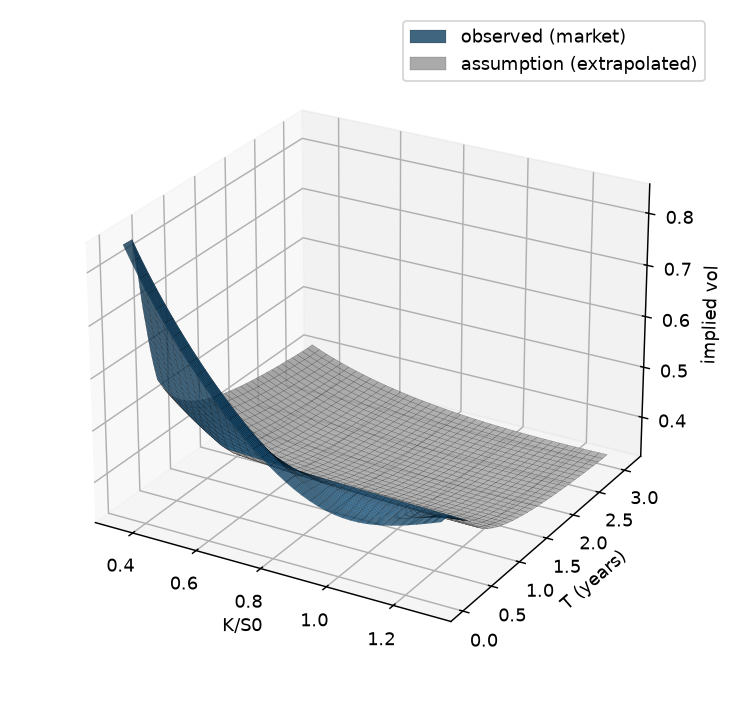

# kospi200-vol-surface

KOSPI200 옵션 시장가격으로 만기별 SABR을 calibration하고, 차익거래 없는 연속 변동성 곡면을 만듭니다. 이 곡면은 다음 단계에서 local vol로 실제 발행 ELS를 평가하는 데 씁니다.



## 과제 개요

U.FE.A 금융공학 학회 2026년 하반기 10·11주차에 이어지는 2주 과제입니다. 팀장으로서 과제를 설계하고 해답을 작성했습니다. 이 저장소는 1주차(SABR 곡면) 해답을 패키지로 정리한 것이고, 2주차(local vol, ELS)는 그 마감 뒤에 더합니다.

앞선 과제들은 변동성 하나를 주어진 값으로 썼습니다. 이 과제는 행사가와 만기마다 다른 변동성을 시장가격에서 직접 읽어 냅니다. 곡면의 범위(T = 0 ~ 3.1년, K/S0 = 0.35 ~ 1.30)는 평가할 ELS(미래에셋증권 제38133회, 기초자산 KOSPI200)의 만기와 낙인 수준을 덮도록 정했습니다.

## 접근 방식

모델을 맞추기 전에 시장 데이터를 믿을 수 있는지부터 판단하고, 모델 결과가 차익거래를 만들면 고칩니다. 과제에서 학생이 직접 정해야 하는 값은 두 개였고, 단계마다 assert 검증을 두어 판단이 틀리면 통과하지 못하게 했습니다.

**forward.** 데이터에는 forward가 없습니다. 선물 종가, 무배당 carry, 옵션 가격에서 역산한 값 가운데 put-call parity로 구한 값을 골랐습니다. 옵션 IV를 맞추는 forward는 옵션 가격과 정합적이어야 하기 때문입니다. 12월물 parity forward(1056.2)는 선물 종가(1048.4)보다 약 74bp 높았습니다. 그래도 parity forward를 쓰면 같은 행사가의 콜과 풋이 4bp 안쪽의 같은 vol로 설명됩니다. 그래서 선물 종가와 옵션 정산가가 찍힌 시점이 다른 데서 생긴 차이로 봤습니다. 무배당 carry는 KOSPI200 배당을 무시하므로 쓰지 않았습니다.

**만기 선택.** 11개 만기 가운데 4개(2026-11, 2026-12, 2027-01, 2027-03)만 썼습니다. 10월물은 만기가 한 달도 남지 않아 스마일이 왜곡되고, 6월물 이후는 선물과 옵션 모두 체결이 거의 없어 이론정산가 위주입니다. 3월물도 선물은 29계약만 체결됐고 옵션 가격 32개 중 31개가 이론정산가입니다. 그래서 3월물은 쓰되 장기 외삽의 기준으로는 삼지 않았습니다.

**차익거래 제거.** SABR slice를 그대로 이어 붙이면 calendar 차익이 154건 생깁니다. 모두 2027-01에서 2027-03 사이, K/F < 0.56 영역입니다. 두 만기 모두 이 영역에 데이터가 없는 SABR 외삽 구간인데, 2027-01의 날개(ν = 0.94)가 거의 평평한 2027-03(ν = 0.07)보다 높아 total variance가 만기에 따라 줄어듭니다. 관측 slice의 total variance에 하한 w_i(m) ≥ w_{i-1}(m)을 두어 0건으로 만들었습니다. 이 하한은 시장 데이터가 있는 K/F ≥ 0.59에서는 값을 바꾸지 않습니다.

**장기 가정.** 마지막 관측 만기 이후는 가정으로 만듭니다. 3Y slice의 ρ, ν는 가장 유동적인 2026-12에서 가져오고 α는 3Y vol이 ELS 투자설명서의 평가 변동성 35.47%가 되도록 맞춥니다. 투자설명서는 이 값을 Volatility Surface에서 VIX 방법론(Jiang and Tian, 2005)으로 산출했다고 적고 있습니다. OTM 옵션 가격을 적분한 model-free implied variance이므로 ATM vol이 아니라 variance-swap vol에 맞췄습니다.

## 구현

```
kospi200-vol-surface/
├── src/volsurface/
│   ├── config.py       기준일, 현물가, 금리 호가, ELS 입력값
│   ├── curve.py        CD91 + 국고채 par yield 부트스트랩, 만기일
│   ├── forward.py      put-call parity forward
│   ├── sabr.py         Black 가격·IV, Hagan (2.17) β = 1
│   ├── calibrate.py    만기별 calibration
│   ├── surface.py      total variance 보간, calendar 하한, 장기 가정, variance-swap vol
│   └── arbitrage.py    calendar, butterfly 점검
├── scripts/preprocess.py     KRX 원자료 → data/*.csv
├── notebooks/01_surface.ipynb
├── figures/                  smile fit, 3D surface, term structure
└── tests/
```

- 모든 계산은 NumPy 배열 연산입니다. SABR와 implied vol을 대신 계산하는 라이브러리는 쓰지 않았습니다.
- `sabr_vol`은 K = F에서 z/x(z)의 0/0을 1로 처리해 nan 없이 Hagan (2.18)과 같은 값을 냅니다.
- 할인곡선은 CD 91일(단리)과 국고채 1·2·3·5년 par yield(반기 이표)로 부트스트랩하고, 노드 사이는 ln DF 선형 보간입니다.
- KRX 원자료와 가공 CSV는 약관 때문에 저장소에 넣지 않습니다. 테스트는 calibration 결과인 SABR 파라미터(`tests/fixtures/sabr_params.csv`)로 곡면을 만들어 돌립니다.

## 실행 결과

기준일 2026-09-14, S0 = 1050.83. `notebooks/01_surface.ipynb` 실행 출력입니다.

| 만기 | T | parity F | α | ρ | ν | 점 수 | RMSE |
|---|---:|---:|---:|---:|---:|---:|---:|
| 2026-11 | 0.162 | 1048.66 | 0.4221 | −0.0893 | 1.5683 | 79 | 176bp |
| 2026-12 | 0.238 | 1056.22 | 0.4246 | −0.0723 | 1.3000 | 162 | 65bp |
| 2027-01 | 0.334 | 1054.55 | 0.4330 | −0.0918 | 0.9406 | 16 | 19bp |
| 2027-03 | 0.488 | 1051.34 | 0.4422 | −0.5855 | 0.0654 | 32 | 36bp |

| 항목 | 값 |
|---|---:|
| 12월물 parity forward − 선물 종가 | 약 74bp |
| calendar 위반 (하한 전 → 후) | 154 → 0 |
| butterfly 위반 | 0 |
| 3Y variance-swap vol | 35.47% (공시 평가 변동성과 일치) |
| 3Y ATM vol | 33.28% |

74bp는 parity forward를 구할 때 쓰는 행사가 범위에 따라 74.4bp(전처리, forward 기준 ±5%)와 74.6bp(노트북, S0 기준 ±5%)로 조금 달라집니다.



## 결과 분석

2026-11은 RMSE가 176bp로 가장 큽니다. 그림에서 보듯 ATM 위쪽 행사가에서 점이 크게 흩어져 있고, 이 만기의 가격 79개 중 56개가 이론정산가입니다. 가중치를 균등하게 두었으므로 이 흩어짐이 그대로 RMSE에 들어갑니다.

2027-03의 ρ = −0.59는 믿기 어렵습니다. ρ가 스마일에 주는 효과는 모두 ν와 곱해져 나타나는데 이 만기는 ν ≈ 0.07이라 ρ가 거의 식별되지 않습니다. 장기 가정의 기준을 2026-12로 둔 이유입니다.

3Y variance-swap vol(35.47%)이 ATM vol(33.28%)보다 높습니다. variance-swap vol은 모든 행사가의 OTM 옵션을 1/K² 가중으로 적분하므로 낮은 행사가의 높은 vol이 크게 반영됩니다. 공시 평가 변동성을 ATM vol로 잘못 읽으면 장기 구간의 vol이 그만큼 높아집니다.

**한계.** 3년 구간과 낙인 40% 영역은 시장가격이 아니라 가정으로 만든 부분입니다. 2주차 ELS 가격은 이 가정(3Y slice의 기준, 장기 ρ·ν, 배당 가정)에 민감할 것으로 봅니다. calendar 하한은 데이터가 없는 날개만 고치는 최소한의 처리이고, 날개의 모양 자체는 여전히 SABR 외삽입니다.

## 이슈 기록

**선물 종가를 forward로 쓰면 콜·풋 vol이 어긋남.** 12월물 선물 종가(1048.4)를 forward로 쓰면 같은 행사가의 콜과 풋 IV 차이가 중앙값 385bp로 벌어집니다. parity forward에서는 4bp입니다. 3월물도 396bp와 6bp로 같은 양상입니다. 과제의 forward 검증 셀은 콜·풋 vol 차이의 중앙값이 50bp를 넘으면 실패하도록 했습니다.

**SABR 외삽끼리 교차해 calendar 차익 발생.** 위 "차익거래 제거"에 적었습니다. 위반 위치를 만기 구간과 K/F로 묶어 출력하면 원인이 데이터 없는 날개라는 것이 바로 보입니다.

## 실행 방법

Python 3.10 이상.

```bash
pip install -e ".[dev]"
pytest
```

노트북을 다시 돌리려면 KRX 정보데이터시스템에서 2026-09-14 KOSPI200 옵션·선물 일별 시세(주간)를 받아 `data/raw/kospi200_options.csv`, `data/raw/kospi200_futures.csv`로 저장한 뒤:

```bash
pip install -e ".[notebook]"
python scripts/preprocess.py
cd notebooks
python -m nbconvert --to notebook --execute --inplace 01_surface.ipynb
```

`data/`에 가공 CSV가 있으면 전체 파이프라인이 테스트 파라미터를 재현하는지 확인하는 테스트도 함께 돕니다.

## 개발 방식

과제 설계, 데이터 가공, 해답 노트북은 직접 작성했습니다. 포트폴리오 정리에는 Claude Code를 썼습니다. 해답 노트북을 `src/volsurface/` 모듈로 나누고, 테스트, CI, 이 README를 추가했습니다.

검증은 이렇게 했습니다.

- 패키지로 옮긴 코드를 원본 데이터로 돌려 parity forward, SABR 파라미터, RMSE, 위반 건수, 3Y vol이 해답 노트북 출력과 모두 같은지 확인했습니다.
- `scripts/preprocess.py`가 원자료에서 만든 CSV 4개가 과제 배포 파일과 값까지 같은지 대조했습니다.
- 하한을 끈 곡면에서 위반 154건이 재현되는지 테스트로 고정했습니다.

`tests/`의 테스트:

| 테스트 | 확인 내용 |
|---|---|
| `test_sabr.py` | K = F에서 nan 없음, Hagan (2.18) ATM 값과 (2.17) 날개 참값 일치 |
| `test_curve.py` | 부트스트랩 커브가 입력 호가 5개(CD91, 국고채 1·2·3·5년)를 재현 |
| `test_surface.py` | calibration 곡면의 calendar·butterfly 위반 0건, 하한을 끄면 154건, 데이터 구간에서 fit 유지, 3Y variance-swap vol = 35.47% |

## 참고 문헌

- Hagan, P. S., Kumar, D., Lesniewski, A. S., Woodward, D. E. (2002). Managing Smile Risk. *Wilmott Magazine*.
- Jiang, G. J., Tian, Y. S. (2005). The Model-Free Implied Volatility and Its Information Content. *Review of Financial Studies*.
- 미래에셋증권 제38133회 ELS 투자설명서 (전자공시)
